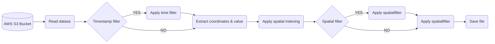

# Jua.ai’s Geospatial Data Engineering Assessment

Pipeline to transform the data into the Apache Parquet datasource



The pipeline developed in the Python CLI format with following flags:

 - `file_name`: The file name e.g. precipitation_amount_1hour_Accumulation.nc in S3 bucket
 - `date`: Date of corresponding data in **YYYY-MM** format
 - `timestamp_filter`: The span of time between a specific start date and end date in **YYYY-MM-DD** format
 - `spatial_filter`: Corrosponding coordinate to filter in (**latitude longitude**) format
 - `resolution`: Resolution for hierarchical geospatial indexing; default:10
 - `output_path`: Path to save the parquet file.

# Setting up the environment

Use provided `requirements.txt` or `Dockerfile` to set up the envirnment.

## Instructions for Docker
### Build new image
Build a new docker image using provided `Dockerfile`. All the required packages would be installed for this pipeline. e.g.

```
docker build -t jua_env:0.0.1 .
```
### Running container
The script can run directly or inside the container using the following code.

```
docker run --rm -it \
            -v $(pwd):/jua_ETL_task \
            --name jua_task \
            jua_env:0.0.1 \
            main.py --file_name precipitation_amount_1hour_Accumulation.nc --date 2022-05 \
            --timestamp_filter 2022-05-10 2022-05-15 --spatial_filter 62.030042822678894 24.80980571945065 \
            --output_path ./precipitation_amount_20220510_20220515.parquet
```