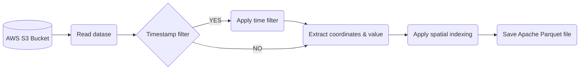

# Geospatial Data Engineering Assessment

Pipeline to transform the data into the Apache Parquet datasource



The pipeline developed in the Python CLI format with following flags:

 - `file_name`: The file name e.g. precipitation_amount_1hour_Accumulation.nc in S3 bucket
 - `date`: Date of corresponding data in **YYYY-MM** format
 - `timestamp_filter`: The span of time between a specific start date and end date in **YYYY-MM-DD** format
 - `resolution`: Resolution for hierarchical geospatial indexing; default:10
 - `output_path`: Path to save the parquet file.

# Setting up the environment

Use provided `requirements.txt` or `Dockerfile` to set up the envirnment.

## Instructions for AWS ECS
### Build new image
Build a new docker image using provided `Dockerfile`. All the required packages would be installed for this pipeline, and save the build image in AWS ECR.

```
docker build -t exp_env:0.0.1 .
```
### Running container
Create a cluster with EC2 instance, and define the task in AWS ECS. Do not forget to give the S3 acess to container using IAM role. This way the can be uploaded in S3 bucket.